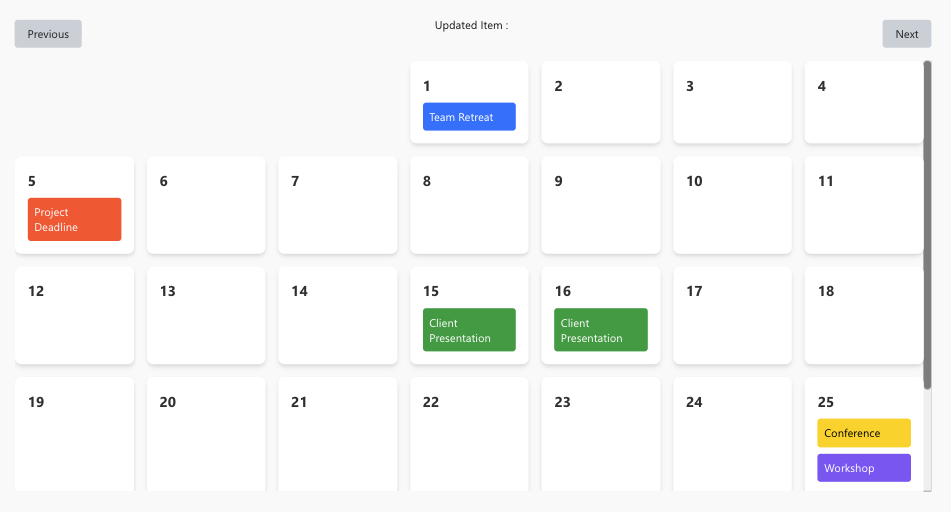
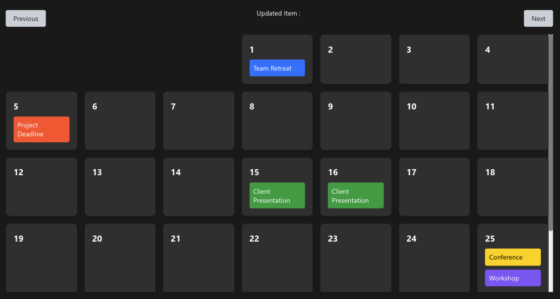

# Calendar

A custom PowerApps Component Framework (PCF) control developed by **Shaheer Ahmad**.

## Description

The **Calendar** component brings a robust calendar interface to your Power Apps, allowing users to view and interact with date-based data intuitively.

## Previews

    
    

## Features

-   **Calendar View**: Display data in a monthly or weekly calendar format.
-   **Customizable**: Adjust text and background colors (`dateTextColor`, `dateBackgroundColor`).
-   **Interactive**: Select dates and update data.

## Installation

### Download Solution
You can download the managed solution directly from the `Solutions` folder:

📥 **[Download PCFCalendar Solution](./Solutions/PCFCalendar_1_0_0_1_managed.zip)**

### Import into Power Apps
1.  Download the generic solution zip file using the link above.
2.  Go to the [Power Apps Maker Portal](https://make.powerapps.com/).
3.  Select the correct environment from the top right corner.
4.  Navigate to **Solutions** in the left sidebar.
5.  Click **Import solution** in the top header.
6.  Click **Browse** and select the downloaded `PCFCalendar_1_0_0_1_managed.zip` file.
7.  Click **Next** and follow the on-screen instructions to finish the import.

### Add to Canvas App
1.  Open your Canvas App in editing mode.
2.  In the left navigation bar, click on **Insert** (+).
3.  Click **Get more components** (usually at the bottom).
4.  Select the **Code** tab.
5.  Find and select the **Calendar** component.
6.  Click **Import**.
7.  The component will now be available under the **Code components** section in the Insert menu.

## Usage

1.  Add the **Calendar** component to your screen.
2.  Bind the `calendarData` property to your data source.
3.  Set the `calendarDate` property to control the default focused date.
4.  Customize the look by adjusting `dateTextColor` and `dateBackgroundColor`.

## Creator

**Shaheer Ahmad**
-   GitHub: [shaheerahmadch](https://github.com/shaheerahmadch)

## License

This project is licensed under the MIT License.
